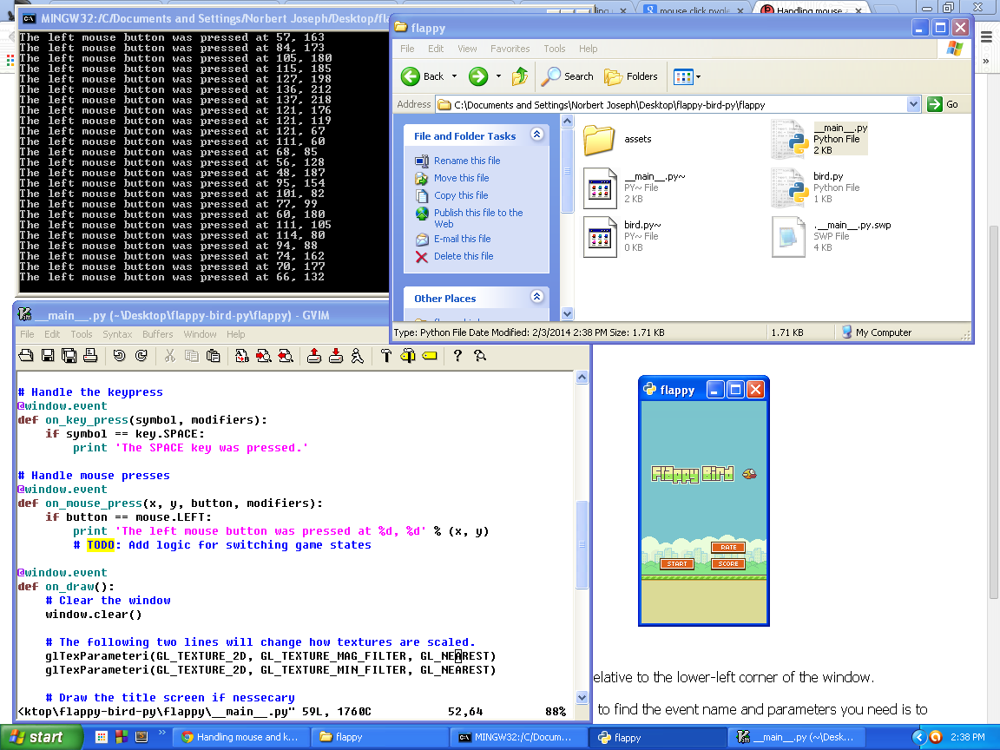

[flappy-bird-py]() - another python port
==============

```flappy-bird-py``` is built atop of ```pyglet```, which in turn, is built atop of ```opengl```. This project aims to provide an accurate desktop port of the popular Android and iOS game. To get started do the following.

```bash
$ git clone https://github.com/shrimpboyho/flappy-bird-py
$ cd flappy-bird-py
$ make
```


